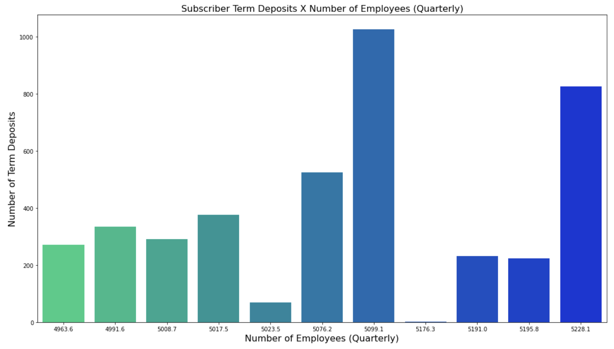
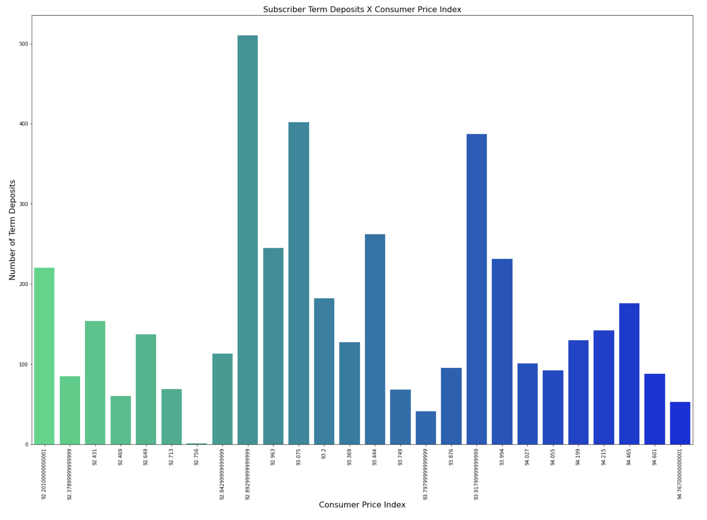
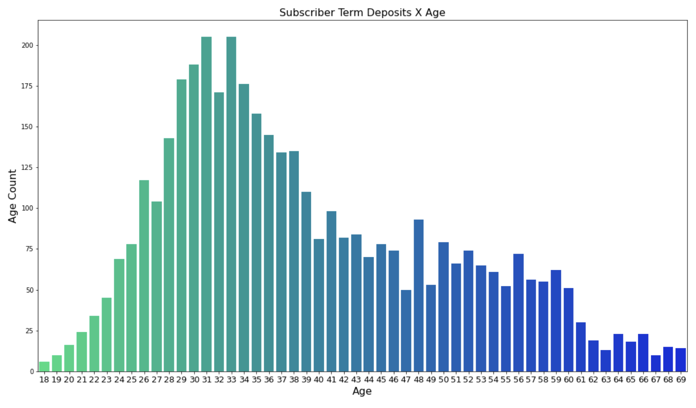

# Banking Features & Subscriber Term Deposits  
## Predicting Drivers of Subscriber Term Deposits

**Authors**: Miguel Santana
**Student Pace**: Full Time
**Project Review Date/Time**: 10/14/2020, 12-12:45pm
**Instructor name**: James Irving
**Blog post URL**: TBA

The contents of this repository detail an analysis of client, campaign, social, economic and misc. features provided by a Portuguese bank. This analysis is detailed in hopes of making the work accessible and replicable.

### Business problem:

A Portuguese financial institution provided data resulting from various direct telemarketing campaigns (Moro et al., 2014). The Portuguese bank looks to analyze the various client, campaign, social, economic and miscellaneous features to identify their significance as they relate to subscriber term deposits. 

### Data
The dataset includes the following client, campaign, social, economic and other attributes:

**Client Data**
* Age
* Job Type
* Marital Status
* Education 
* Default **(client credit in default)**
* Housing **(client housing loan)**
* Loan **(client personal loan)**

**Current Campaign | Last Contact** 
* Contact Type
* Month 
* Day of Week 
* Duration (in seconds)

**Other Attributes:**
* Campaign (number of contacts/this campaign)
* Pdays (days since last contacted/previous campaign)
* Previous (contacts performed before this campaign/this client)
* Poutcome (previous campaign outcome)

**Social & Economic Context Attributes**
* Emp.var.rate (quarterly employment variation rate)
* Cons.price.idx (monthly indicator - consumer price index)
* Cons.conf.idx (monthly indicator - consumer confidence index)
* Euribor3m (daily indicator - euribor 3 month rate)
* Nr.employed (quarterly indicator - number of employees)

**Output/Target**
* y (has the client subscribed a term deposit?)

## Methods
**OSEMN Framework**
* Obtain
* Scrub
* Explore
* Model
* Interpret

**Choices**
- Renaming Target Variable
- Dropping "Unknown" Variables in Client Features
- Addressing Outlier Data (Age)
- Using Multiple Models | Selecting Top Features

## Results

The top model was Catboost. Synthetic Minority Over-sampling Technique (SMOTE) was used to balance the classes in our dataset but did not increase the performance of our models. While the total performance did not increase, the hierarchy of performance udpated to show Random Forest as a close second place performer. 

**There are 23 total items appearing in both classifier feature lists with 3 important features showing up in the top 5 of both lists. Those significant features are:
The most important features in both lists are**:
* **Number of employees | quarterly indicator (nremployed)**
* **Consumer Price Index | monthly indicator (conspriceidx)**
* **Age**

#### Subscriber Term Deposits X Number of Employees

> Term Deposits are highest when the average number of employees is 5099.1, 5228.1 and 5076.2 respectively. 

#### Subscriber Term Deposits X Consumer Price Index

> Term Deposits are highest when the consumer price index is 92.893, 93.075 and 93.918 respectively.

#### Subscriber Term Deposits X Consumer Price Index

> Term Deposits are highest when client age is between 28 and 38 years old.

## Recommendations:

More of your own text here

## Limitations & Next Steps

More of your own text here

### For further information
Please review the narrative of our analysis in [our jupyter notebook](./student.ipynb) or review our [presentation](./powerpoint.pdf)

For any additional questions, please contact **Miguel Santana at msantana269@gmail.com**)
