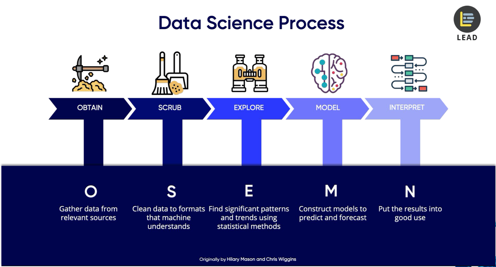
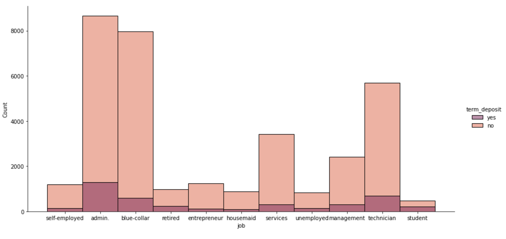
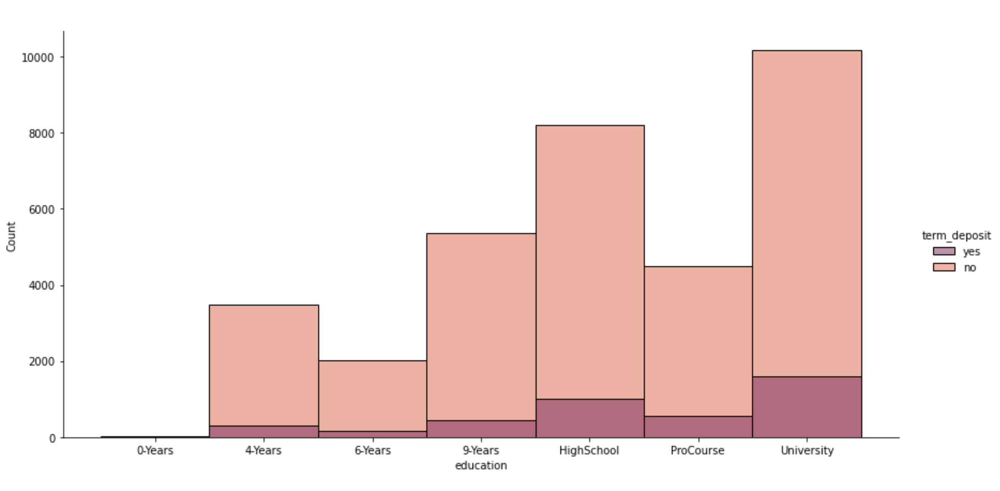

# Banking Features & Subscriber Term Deposits  
## Predicting Drivers of Subscriber Term Deposits

* **Author**: Miguel Santana
* **Student Pace**: Full Time
* **Project Review Date/Time**: 10/14/2020, 12-12:45pm
* **Instructor name**: James Irving
* **Blog post URL**: TBA

The contents of this repository detail an analysis of client, campaign, social, economic and misc. features provided by a Portuguese bank. This analysis is detailed in hopes of making the work accessible and replicable.

### Business problem:

A Portuguese financial institution provided data resulting from various direct telemarketing campaigns (Moro et al., 2014). The Portuguese bank looks to analyze the various client, campaign, social, economic and miscellaneous features to identify their significance as they relate to subscriber term deposits. 

### Data
The dataset includes the following client, campaign, social, economic and other attributes:

**Client Data**
* Age
* Job Type
* Marital Status
* Education 
* Default **(client credit in default)**
* Housing **(client housing loan)**
* Loan **(client personal loan)**

**Current Campaign | Last Contact** 
* Contact Type
* Month 
* Day of Week 
* Duration (in seconds)

**Other Attributes:**
* Campaign (number of contacts/this campaign)
* Pdays (days since last contacted/previous campaign)
* Previous (contacts performed before this campaign/this client)
* Poutcome (previous campaign outcome)

**Social & Economic Context Attributes**
* Emp.var.rate (quarterly employment variation rate)
* Cons.price.idx (monthly indicator - consumer price index)
* Cons.conf.idx (monthly indicator - consumer confidence index)
* Euribor3m (daily indicator - euribor 3 month rate)
* Nr.employed (quarterly indicator - number of employees)

**Output/Target**
* y (has the client subscribed a term deposit?)

## Process

**The OSEMN Framework was used to analyze the data**

**Choices**
- Renaming Target Variable
- Dropping "Unknown" Variables in Client Features
- Addressing Outlier Data (Age)
- Using Multiple Models | Selecting Top Features

## Exploratory Data Analysis | Client Features
**Visualizing Age**

**Visualizing Job Type**

**Visualizing Education Level**

## Results | Conclusion

The dataset offered various consumer trends and illustrated multiple areas of opportunity. In most cases, the features that related to these constants represented both; highest number of subscribers and highest number of non-subscribers. This leads us to believe that consistency and performance metrics are not followed as the volume of work increases resulting in a natural increase of total subscribers but an exponential increase in consumers who decline term deposit products. Selected customer and bank features will be evaluated in the business recommendations below. 

## Business Recommendations

1) Consumers between the ages of 30 and 40 make up the largest amount of term deposit subscribers but also reflect the largest amount of non-subscribing customers. The age group with the smallest gap between subscribing and non-subscribing customers includes customers ages 17 to 25. Construct and apply similarly structured marketing, outreach and advertising techniques to the customer age segment 30 to 40 in order to convert additional non-subscribing customers. 

2) The gap between number of subscribing and non-subscribing customers begins to grow significantly once the number of quarterly employed employees goes over 5076. While the number of subscribed term deposits does continue to grow the level of productivity declines dramatically. Review bank productivity guidelines and drive performance per employee when employee levels go over 5076. 

3) When considering the number of times a consumer has been contacted for the current campaign – there is an obvious decline in the number of subscriber term deposits as the number of contacts per customer increase. Deploy an A team (high performers) to handle customer outreach during the first three contacts to increase the chance of conversion. 

4) The 'days since last contact' data show an abundance of non-subscribing and subscribing consumers in the '999' or 'has not been contacted' category. Deploy a B team to (high performers) to field incoming marketing calls that arrive from numbers that are not registered in the bank's database. In addition, consider methods of dividing customers into 'new' and 'existing' during day-to-day operations.  High performing team members should be deployed to address new bank customers.  

 

## Limitations

The dataset and business insights are limited to customers who specifically cite their job type, marital status and education level when registering as a bank customer. Additionally, the models and features reflect clients that are between 17 and 69 years of age. 

## Future Work
In order to more accurately define the boundaries of our features it is important to understand what customs and cultural influences are tied to this dataset (Portuguese banking info). For example: knowing the average level of education, the geographic locations of client residences and information on financial markets in this region may alter the way we perceive these variables.

Additionally, the dataset illustrates that the vast majority of subscribing consumers enroll in bank products when they are not contacted by telemarketers. It would be helpful to review additional data on these consumers in order to evaluate different means of product conversion (such as social media, the Internet, day-to-day walk-ins, etc.)

### For further information
Please review the narrative of our analysis in [our jupyter notebook](./student.ipynb) or review our [presentation](./powerpoint.pdf)

For any additional questions, please contact **Miguel Santana at msantana269@gmail.com**)
